# 부동산 AI 시스템 흐름도

## 전체 시스템 아키텍처 (LLM 호출 지점 표시)

```mermaid
flowchart TD
    User([사용자 쿼리])

    %% ============================================
    %% 1. API Layer
    %% ============================================
    subgraph API["📁 chat_api.py"]
        APIEndpoint["POST /api/v1/chat"]
        SessionMgr["SessionManager"]
        APIEndpoint --> SessionMgr
    end

    User -->|HTTP POST| APIEndpoint

    %% ============================================
    %% 2. Supervisor
    %% ============================================
    subgraph Supervisor["📁 team_supervisor.py"]
        SupervisorInit["TeamBasedSupervisor"]
        InitNode["initialize_node"]
        PlanningNode["planning_node"]
        RouteNode["route_after_planning"]
        ExecuteNode["execute_teams_node"]
        AggregateNode["aggregate_results_node"]
        ResponseNode["generate_response_node"]

        SupervisorInit --> InitNode
        InitNode --> PlanningNode
    end

    SessionMgr --> SupervisorInit

    %% ============================================
    %% 3. Planning Agent
    %% ============================================
    subgraph PlanningAgentFile["📁 planning_agent.py"]
        AnalyzeIntent["analyze_intent"]
        IntentLLM1["🤖 LLM #1<br/>intent_analysis.txt<br/>temp 0.0 async"]
        IntentCheck{intent_type?}
        SkipAgent["⚡ Skip Agent Selection"]
        SuggestAgent["suggest_agents"]
        AgentLLM2["🤖 LLM #2<br/>agent_selection.txt<br/>temp 0.0 async"]
        CreatePlan["create_execution_plan"]

        AnalyzeIntent --> IntentLLM1
        IntentLLM1 --> IntentCheck
        IntentCheck -->|IRRELEVANT/UNCLEAR| SkipAgent
        IntentCheck -->|Other| SuggestAgent
        SuggestAgent --> AgentLLM2
        AgentLLM2 --> CreatePlan
        SkipAgent --> CreatePlan
    end

    PlanningNode --> AnalyzeIntent

    %% ⚡ Fast Path for IRRELEVANT/UNCLEAR
    FastPathReturn["⚡ Early Return<br/>Minimal State Only<br/>Skip all processing"]
    IntentCheck -.->|"IRRELEVANT/UNCLEAR<br/>Fast Path"| FastPathReturn
    FastPathReturn -.->|"Direct to response"| ResponseNode

    %% ============================================
    %% 4. Query Decomposer
    %% ============================================
    subgraph DecomposerFile["📁 query_decomposer.py"]
        DecompCheck{복합 질문?}
        Decompose["decompose"]
        DecompLLM3["🤖 LLM #3<br/>query_decomposition.txt<br/>temp 0.1 async"]

        DecompCheck -->|Yes| Decompose
        Decompose --> DecompLLM3
    end

    CreatePlan --> DecompCheck
    DecompLLM3 --> RouteNode
    DecompCheck -->|No| RouteNode

    %% ============================================
    %% 5. Routing
    %% ============================================
    RouteNode --> RouteCheck{execution_steps?}
    RouteCheck -->|empty| ResponseNode
    RouteCheck -->|execute| ExecuteNode

    %% ============================================
    %% 6. Search Executor
    %% ============================================
    subgraph SearchFile["📁 search_executor.py"]
        SearchExec["SearchExecutor.execute"]
        KeywordLLM4["🤖 LLM #4<br/>keyword_extraction.txt<br/>temp 0.1 sync"]
        ToolSelLLM5["🤖 LLM #5<br/>tool_selection_search.txt<br/>temp 0.1 async"]
        SearchTools["Execute Tools"]
        LegalTool["LegalSearchTool"]
        MarketTool["MarketDataTool"]
        LoanTool["LoanDataTool"]

        SearchExec --> KeywordLLM4
        KeywordLLM4 --> ToolSelLLM5
        ToolSelLLM5 --> SearchTools
        SearchTools --> LegalTool
        SearchTools --> MarketTool
        SearchTools --> LoanTool
    end

    ExecuteNode --> SearchExec

    %% ============================================
    %% 7. Analysis Executor
    %% ============================================
    subgraph AnalysisFile["📁 analysis_executor.py"]
        AnalysisExec["AnalysisExecutor.execute"]
        AnalysisToolLLM6["🤖 LLM #6<br/>tool_selection_analysis.txt<br/>temp 0.0 async"]
        AnalysisTools["Execute Tools"]
        ContractTool["ContractAnalysisTool"]
        ContractLLM7["🤖 LLM #7<br/>inline prompt<br/>temp 0.3 async"]
        MarketAnalysis["MarketAnalysisTool"]
        MarketInsightLLM8["🤖 LLM #8<br/>insight_generation.txt<br/>temp 0.3 async"]
        SynthesisLLM9["🤖 LLM #9<br/>insight_generation.txt<br/>temp 0.3 async"]

        AnalysisExec --> AnalysisToolLLM6
        AnalysisToolLLM6 --> AnalysisTools
        AnalysisTools --> ContractTool
        AnalysisTools --> MarketAnalysis
        ContractTool --> ContractLLM7
        MarketAnalysis --> MarketInsightLLM8
        ContractLLM7 --> SynthesisLLM9
        MarketInsightLLM8 --> SynthesisLLM9
    end

    ExecuteNode --> AnalysisExec

    %% ============================================
    %% 8. Document Executor
    %% ============================================
    subgraph DocumentFile["📁 document_executor.py"]
        DocExec["DocumentExecutor.execute"]
    end

    ExecuteNode --> DocExec

    %% ============================================
    %% 9. Aggregation
    %% ============================================
    LegalTool --> AggregateNode
    MarketTool --> AggregateNode
    LoanTool --> AggregateNode
    SynthesisLLM9 --> AggregateNode
    DocExec --> AggregateNode
    AggregateNode --> ResponseNode

    %% ============================================
    %% 10. Response Generation
    %% ============================================
    ResponseNode --> ResponseCheck{intent_type?}
    ResponseCheck -->|IRRELEVANT/UNCLEAR| GuidanceMsg["안내 메시지"]
    ResponseCheck -->|Other| LLMCheck{결과 있음?}

    ResponseLLM10["🤖 LLM #10<br/>response_synthesis.txt<br/>temp 0.3 async"]
    SimpleMsg["단순 응답"]

    LLMCheck -->|Yes| ResponseLLM10
    LLMCheck -->|No| SimpleMsg

    %% ============================================
    %% 11. Conversion
    %% ============================================
    subgraph ConverterFile["📁 converters.py"]
        Converter["state_to_chat_response"]
    end

    ResponseLLM10 --> Converter
    GuidanceMsg --> Converter
    SimpleMsg --> Converter
    Converter --> User

    %% ============================================
    %% Styling
    %% ============================================
    classDef llmNode fill:#e3f2fd,stroke:#1976d2,stroke-width:2px
    classDef fileNode fill:#f3e5f5,stroke:#7b1fa2,stroke-width:2px
    classDef skipNode fill:#ffebee,stroke:#c62828,stroke-width:2px
    classDef toolNode fill:#e8f5e9,stroke:#388e3c,stroke-width:2px
    classDef fastPathNode fill:#fff3e0,stroke:#f57c00,stroke-width:3px,stroke-dasharray:5 5

    class IntentLLM1,AgentLLM2,DecompLLM3,KeywordLLM4,ToolSelLLM5,AnalysisToolLLM6,ContractLLM7,MarketInsightLLM8,SynthesisLLM9,ResponseLLM10 llmNode
    class API,Supervisor,PlanningAgentFile,DecomposerFile,SearchFile,AnalysisFile,DocumentFile,ConverterFile fileNode
    class SkipAgent skipNode
    class LegalTool,MarketTool,LoanTool,ContractTool,MarketAnalysis toolNode
    class FastPathReturn fastPathNode
```



## LLM 호출 지점 상세 정리

### 📊 LLM 호출 통계

| # | 호출 위치 | 프롬프트 파일 | 모델 | Temperature | 호출 방식 | 목적 |
|---|----------|-------------|------|-------------|----------|------|
| 1 | PlanningAgent | `intent_analysis.txt` | GPT-4o-mini | 0.0 | async | 사용자 의도 분석 |
| 2 | PlanningAgent | `agent_selection.txt` | GPT-4o-mini | 0.0 | async | Agent 선택 (IRRELEVANT/UNCLEAR은 생략⚡) |
| 2b | PlanningAgent (fallback) | `agent_selection_simple.txt` | GPT-4o-mini | 0.0 | async | 단순 Agent 선택 |
| 3 | QueryDecomposer | `query_decomposition.txt` | GPT-4o-mini | 0.1 | async | 복합 질문 분해 |
| 4 | SearchExecutor | `keyword_extraction.txt` | GPT-4o-mini | 0.1 | **sync** | 검색 키워드 추출 |
| 5 | SearchExecutor | `tool_selection_search.txt` | GPT-4o-mini | 0.1 | async | 검색 도구 선택 |
| 6 | AnalysisExecutor | `tool_selection_analysis.txt` | GPT-4o-mini | 0.0 | async | 분석 도구 선택 |
| 7 | ContractAnalysisTool | ⚠️ 인라인 프롬프트 | GPT-4o-mini | 0.3 | async | 계약서 분석 |
| 8 | MarketAnalysisTool | `insight_generation.txt` | GPT-4o-mini | 0.3 | async | 시장 인사이트 생성 |
| 9 | AnalysisExecutor | `insight_generation.txt` | GPT-4o-mini | 0.3 | async | 분석 인사이트 종합 |
| 10 | TeamSupervisor | `response_synthesis.txt` | GPT-4o-mini | 0.3 | async | 최종 응답 생성 |

### 📁 프롬프트 파일 위치

#### Cognitive Prompts (인지 에이전트)
```
backend/app/service_agent/llm_manager/prompts/cognitive/
├── intent_analysis.txt          ✅ 사용됨 (LLM #1)
├── agent_selection.txt          ✅ 사용됨 (LLM #2)
├── agent_selection_simple.txt   ✅ 사용됨 (LLM #2b, fallback)
├── query_decomposition.txt      ✅ 사용됨 (LLM #3)
└── plan_generation.txt          ❌ 미사용
```

#### Execution Prompts (실행 에이전트)
```
backend/app/service_agent/llm_manager/prompts/execution/
├── keyword_extraction.txt       ✅ 사용됨 (LLM #4)
├── tool_selection_search.txt    ✅ 사용됨 (LLM #5)
├── tool_selection_analysis.txt  ✅ 사용됨 (LLM #6)
├── insight_generation.txt       ✅ 사용됨 (LLM #8, #9)
└── response_synthesis.txt       ✅ 사용됨 (LLM #10)
```

#### Common Prompts
```
backend/app/service_agent/llm_manager/prompts/common/
└── error_response.txt           ❌ 미사용
```

#### ⚠️ 누락된 프롬프트 파일
- `contract_analysis.txt` - ContractAnalysisTool에서 인라인 프롬프트 사용 중

## 🔄 주요 처리 흐름

### 1. IRRELEVANT 쿼리 (빠른 경로) ⚡
```
User → API → Supervisor → Planning
  → PlanningAgent.analyze_intent
    → 🤖 LLM #1: intent_analysis.txt → IRRELEVANT
    → ⚡ Skip LLM #2 (agent_selection)
  → create_execution_plan → Empty Plan
  → _route_after_planning → "respond"
  → generate_response_node → _generate_out_of_scope_response
  → Final Response (안내 메시지)
```
**LLM 호출**: 1회만 (intent_analysis)

### 2. 단순 부동산 질문 (일반 경로)
```
User → API → Supervisor → Planning
  → PlanningAgent.analyze_intent
    → 🤖 LLM #1: intent_analysis.txt → LEGAL_CONSULT
    → 🤖 LLM #2: agent_selection.txt → ["search_team"]
  → create_execution_plan → Simple Plan
  → _route_after_planning → "execute"
  → execute_teams_node
    → SearchExecutor
      → 🤖 LLM #4: keyword_extraction.txt
      → 🤖 LLM #5: tool_selection_search.txt
      → Execute Tools (LegalSearchTool, etc.)
  → aggregate_results_node
  → generate_response_node
    → 🤖 LLM #10: response_synthesis.txt
  → Final Response
```
**LLM 호출**: 5회 (intent + agent + keyword + tool_sel + response)

### 3. 복합 질문 + 분석 (전체 경로)
```
User → API → Supervisor → Planning
  → PlanningAgent.analyze_intent
    → 🤖 LLM #1: intent_analysis.txt → COMPREHENSIVE
    → 🤖 LLM #2: agent_selection.txt → ["search_team", "analysis_team"]
  → 🤖 LLM #3: query_decomposition.txt
  → create_execution_plan → Complex Plan
  → _route_after_planning → "execute"
  → execute_teams_node
    → SearchExecutor
      → 🤖 LLM #4: keyword_extraction.txt
      → 🤖 LLM #5: tool_selection_search.txt
    → AnalysisExecutor
      → 🤖 LLM #6: tool_selection_analysis.txt
      → ContractAnalysisTool
        → 🤖 LLM #7: contract_analysis (인라인)
      → MarketAnalysisTool
        → 🤖 LLM #8: insight_generation.txt
      → 🤖 LLM #9: insight_generation.txt (종합)
  → aggregate_results_node
  → generate_response_node
    → 🤖 LLM #10: response_synthesis.txt
  → Final Response
```
**LLM 호출**: 최대 10회 (모든 LLM 호출)

## 🎯 최적화 포인트

### ✅ 이미 적용된 최적화
1. **IRRELEVANT/UNCLEAR 조기 종료** (LLM #2 생략)
   - 위치: `planning_agent.py:172-181`
   - 효과: ~5초 단축

2. **Intent Analysis 파라미터 최적화**
   - Temperature: 0.1 → 0.0
   - max_tokens: 500 추가
   - 효과: ~0.5초 단축

3. **프롬프트 강화**
   - IRRELEVANT 우선 판단 명시
   - 효과: 정확도 향상

### 💡 추가 최적화 가능
1. **패턴 기반 빠른 감지** (LLM #1도 생략)
   - 간단한 인사말은 LLM 호출 없이 즉시 판단
   - 예상 효과: 5초 → 0.1초

2. **캐싱 전략**
   - 동일 쿼리 재요청 시 결과 재사용
   - Redis/Memcached 활용

3. **병렬 LLM 호출**
   - LLM #4, #5, #6 동시 호출
   - 순차 실행 → 병렬 실행

## 📌 코드 참조

### 주요 파일
- **API**: `backend/app/api/chat_api.py`
- **Supervisor**: `backend/app/service_agent/supervisor/team_supervisor.py`
- **PlanningAgent**: `backend/app/service_agent/cognitive_agents/planning_agent.py`
- **QueryDecomposer**: `backend/app/service_agent/cognitive_agents/query_decomposer.py`
- **SearchExecutor**: `backend/app/service_agent/execution_agents/search_executor.py`
- **AnalysisExecutor**: `backend/app/service_agent/execution_agents/analysis_executor.py`
- **LLMService**: `backend/app/service_agent/llm_manager/llm_service.py`
- **Converter**: `backend/app/api/converters.py`

### 프롬프트 관리
- **프롬프트 디렉토리**: `backend/app/service_agent/llm_manager/prompts/`
- **PromptManager**: `backend/app/service_agent/llm_manager/prompt_manager.py`

---

**생성일**: 2025-10-09
**버전**: 1.0
**마지막 업데이트**: IRRELEVANT 최적화 및 프롬프트 강화 반영
