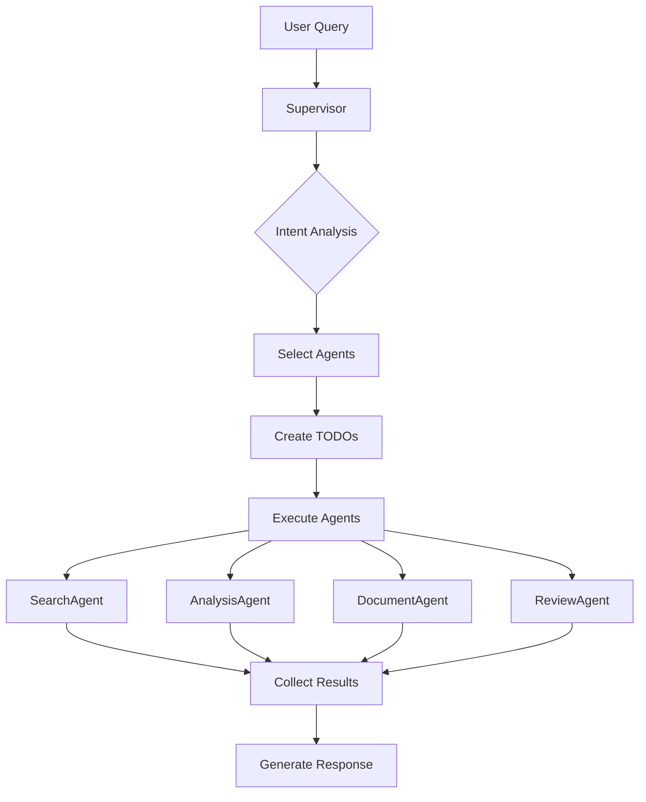

# 시스템 아키텍처 상세 매뉴얼
## Real Estate Chatbot System - Complete Technical Documentation

> 작성일: 2025-10-02
> 버전: 1.0.0
> 목적: 다음 작업 시 이 문서만 보고 전체 시스템을 이해하고 개발할 수 있도록 상세히 기록

---

## 📋 목차

1. [시스템 개요](#1-시스템-개요)
2. [디렉토리 구조](#2-디렉토리-구조)
3. [핵심 컴포넌트](#3-핵심-컴포넌트)
4. [Agent 상세 명세](#4-agent-상세-명세)
5. [Tool 상세 명세](#5-tool-상세-명세)
6. [데이터베이스 구조](#6-데이터베이스-구조)
7. [실행 흐름](#7-실행-흐름)
8. [테스트 시스템](#8-테스트-시스템)
9. [개발 가이드](#9-개발-가이드)
10. [문제 해결 가이드](#10-문제-해결-가이드)

---

## 1. 시스템 개요

### 1.1 시스템 목적
부동산 관련 정보 검색, 분석, 문서 생성, 계약서 검토를 수행하는 AI 기반 챗봇 시스템

### 1.2 기술 스택
- **프레임워크**: LangGraph 0.6+
- **언어**: Python 3.11+
- **LLM**: OpenAI GPT-4
- **벡터 DB**: ChromaDB
- **메타데이터 DB**: SQLite
- **임베딩 모델**: KR-SBERT-V40K-klueNLI-augSTS

### 1.3 주요 특징
- Multi-Agent 아키텍처
- SQL + Vector DB 하이브리드 검색
- 규칙 기반 문서 검토
- 템플릿 기반 문서 생성
- TODO 기반 작업 추적

---

## 2. 디렉토리 구조

```
backend/app/service/
├── agents/                      # Agent 구현체
│   ├── __init__.py             # Agent 레지스트리
│   ├── search_agent.py         # 검색 Agent [구현 완료]
│   ├── analysis_agent.py      # 분석 Agent [구현 완료]
│   ├── document_agent.py      # 문서 생성 Agent [신규 구현]
│   └── review_agent.py        # 계약 검토 Agent [신규 구현]
│
├── tools/                       # Tool 구현체
│   ├── __init__.py             # Tool 레지스트리
│   ├── base_tool.py            # 기본 Tool 클래스
│   ├── legal_search_tool.py   # 법률 검색 (실제 DB)
│   ├── regulation_search_tool.py  # 규정 검색 (Mock)
│   ├── loan_search_tool.py    # 대출 검색 (Mock)
│   ├── real_estate_search_tool.py # 매물 검색 (Mock)
│   ├── document_generation_tool.py # 문서 생성 [신규]
│   ├── contract_review_tool.py     # 계약 검토 [신규]
│   └── analysis_tools.py      # 분석 도구들
│
├── core/                        # 핵심 모듈
│   ├── states.py               # State 정의 (LangGraph)
│   ├── context.py              # LLM Context 관리
│   ├── todo_types.py           # TODO 시스템
│   ├── agent_specifications.py # Agent 명세서
│   └── config.py               # 설정 관리
│
├── supervisor/                  # Supervisor (오케스트레이터)
│   └── supervisor.py           # Agent 오케스트레이션
│
├── data/storage/legal_info/     # 데이터 저장소
│   ├── chroma_db/              # 벡터 임베딩 DB
│   ├── sqlite_db/              # 메타데이터 DB
│   └── embedding/              # 임베딩 모델
│
├── tests/                       # 테스트 코드
│   ├── hard_query_test_100.py  # 100개 쿼리 테스트
│   ├── test_specific_article_search.py # 특정 조항 검색
│   ├── test_nonexistent_laws.py # 없는 법률 테스트
│   └── test_new_agents.py      # 신규 Agent 테스트
│
└── reports/                     # 분석 보고서
    ├── SYSTEM_ARCHITECTURE_MANUAL.md # 이 문서
    └── LLM_CALL_ANALYSIS.md    # LLM 호출 분석
```

---

## 3. 핵심 컴포넌트

### 3.1 Supervisor
**파일**: `supervisor/supervisor.py`

**역할**:
- 사용자 의도 분석
- 적절한 Agent 선택 및 실행
- Agent 간 워크플로우 관리
- TODO 추적 및 관리

**주요 메서드**:
```python
async def analyze_intent(query: str) -> Dict  # 의도 분석
async def create_execution_plan(query, intent) -> Dict  # 실행 계획
async def execute_agents_node(state) -> Dict  # Agent 실행
```

### 3.2 State Management (LangGraph)
**파일**: `core/states.py`

**정의된 States**:
1. **SupervisorState**: Supervisor 전체 상태
2. **SearchAgentState**: 검색 Agent 상태
3. **AnalysisAgentState**: 분석 Agent 상태
4. **DocumentAgentState**: 문서 생성 상태 [신규]
5. **ReviewAgentState**: 계약 검토 상태 [신규]

**State 필드 예시**:
```python
class DocumentAgentState(TypedDict):
    chat_session_id: str
    original_query: str
    document_type: str
    document_params: Dict[str, Any]
    generated_document: Optional[Dict[str, Any]]
    document_format: str
    status: str
    todos: List[Todo]
```

### 3.3 TODO System
**파일**: `core/todo_types.py`

**목적**: 작업 진행 상황 추적 및 관리

**TODO 상태**:
- `pending`: 대기 중
- `in_progress`: 진행 중
- `completed`: 완료
- `failed`: 실패

---

## 4. Agent 상세 명세

### 4.1 SearchAgent (검색 에이전트)
**상태**: ✅ Production

**기능**:
- 법률 정보 검색
- 부동산 매물 검색
- 대출 상품 검색
- 규정 및 정책 검색

**사용 도구**:
- `legal_search_tool` (실제 DB)
- `real_estate_search_tool` (Mock)
- `loan_search_tool` (Mock)
- `regulation_search_tool` (Mock)

**실행 흐름**:
1. 키워드 분석
2. 검색 계획 수립
3. 도구 병렬 실행
4. 결과 수집 및 정리

### 4.2 AnalysisAgent (분석 에이전트)
**상태**: ✅ Production

**기능**:
- 시장 현황 분석
- 트렌드 분석
- 비교 분석
- 투자 가치 평가
- 리스크 평가

**사용 도구**:
- `market_analyzer`
- `trend_analyzer`
- `comparative_analyzer`
- `investment_evaluator`
- `risk_assessor`

**실행 흐름**:
1. 데이터 전처리
2. 분석 계획 수립
3. 분석 도구 실행
4. 인사이트 도출
5. 보고서 생성

### 4.3 DocumentAgent (문서 생성 에이전트)
**상태**: ✅ Production [신규 구현]

**지원 문서**:
- 임대차계약서
- 매매계약서
- 전세계약서
- 월세계약서
- 내용증명
- 계약해지통지서

**출력 형식**:
- TEXT (기본)
- HTML
- JSON
- DOCX (예정)
- PDF (예정)

**실행 흐름**:
1. 문서 유형 감지
2. 파라미터 검증
3. 템플릿 선택
4. 문서 생성
5. 형식 변환

### 4.4 ReviewAgent (계약 검토 에이전트)
**상태**: ✅ Production [신규 구현]

**검토 항목**:
- 위험 요소 분석
- 법적 준수사항
- 문서 완성도
- 불공정 조항

**위험 레벨**:
- `low`: 낮음
- `medium`: 중간
- `high`: 높음
- `critical`: 매우 높음

**실행 흐름**:
1. 문서 추출
2. 유형 분석
3. 위험 스캔
4. 준수사항 확인
5. 보고서 생성

---

## 5. Tool 상세 명세

### 5.1 LegalSearchTool (법률 검색)
**상태**: ✅ Production (실제 DB 사용)

**데이터베이스**:
- **ChromaDB**: 벡터 임베딩 (46,476 문서)
- **SQLite**: 메타데이터

**특징**:
- SQL + Vector 하이브리드 검색
- 특정 조항 검색 지원 (예: "주택임대차보호법 제7조")
- 존재하지 않는 법률 감지

**검색 로직**:
```python
1. SQL에서 법률 존재 확인
2. 존재하면 chunk_id 조회
3. ChromaDB에서 벡터 검색
4. 메타데이터 보강 후 반환
```

### 5.2 DocumentGenerationTool
**상태**: ✅ Production (Mock 데이터)

**템플릿 예시**:
```python
templates = {
    "임대차계약서": """
    부동산 임대차 계약서

    임대인: {lessor_name}
    임차인: {lessee_name}

    제1조 (목적물)
    소재지: {property_address}

    제2조 (보증금과 월세)
    보증금: {deposit}원
    월세: {monthly_rent}원
    ...
    """
}
```

### 5.3 ContractReviewTool
**상태**: ✅ Production (규칙 기반)

**검토 규칙 예시**:
```python
risk_patterns = [
    {
        "pattern": r"중도\s*해지.*불가",
        "risk_level": "high",
        "description": "중도 해지 불가 조항"
    }
]
```

---

## 6. 데이터베이스 구조

### 6.1 SQLite 스키마
**파일**: `data/storage/legal_info/sqlite_db/schema.sql`

```sql
CREATE TABLE documents (
    id INTEGER PRIMARY KEY,
    title TEXT,           -- 통합 제목 필드
    doc_type TEXT,        -- law, decree, rule
    category TEXT,
    chapter TEXT,
    section TEXT,
    article_number TEXT,
    article_title TEXT,
    content TEXT,
    chunk_ids TEXT        -- ChromaDB chunk IDs (JSON)
);
```

### 6.2 ChromaDB 구조
**Collection**: `korean_legal_documents`

**Metadata 필드**:
- `title`: 문서 제목 (통합)
- `doc_type`: 문서 유형
- `category`: 카테고리
- `article_number`: 조항 번호
- `chunk_id`: 고유 ID

---

## 7. 실행 흐름

### 7.1 전체 워크플로우


### 7.2 Agent 실행 예시
```python
# Supervisor에서 Agent 실행
if agent_name == "document_agent":
    from agents.document_agent import DocumentAgent

    agent = DocumentAgent()
    result = await agent.execute({
        "original_query": query,
        "document_type": "임대차계약서",
        "document_params": {...},
        "chat_session_id": session_id
    })
```

---

## 8. 테스트 시스템

### 8.1 법률 검색 테스트
**파일**: `tests/hard_query_test_100.py`

**테스트 내용**:
- Part 1 (1-50): 실제 법률 검색
- Part 2 (51-100): 존재하지 않는 법률

**성공 기준**:
- 실제 법률: 정확한 결과 반환
- 없는 법률: "찾을 수 없습니다" 메시지

### 8.2 신규 Agent 테스트
**파일**: `tests/test_new_agents.py`

**테스트 항목**:
- DocumentAgent: 계약서 생성
- ReviewAgent: 위험 요소 감지

---

## 9. 개발 가이드

### 9.1 새 Agent 추가 방법

#### Step 1: State 정의
```python
# core/states.py
class NewAgentState(TypedDict):
    chat_session_id: str
    original_query: str
    # ... 필요한 필드 추가
```

#### Step 2: Agent 구현
```python
# agents/new_agent.py
class NewAgent:
    def __init__(self):
        self.logger = logging.getLogger("NewAgent")
        self.graph = None
        self.app = None
        self._setup_graph()

    def _setup_graph(self):
        workflow = StateGraph(NewAgentState)
        # 노드 추가
        # 엣지 연결
        self.app = workflow.compile()

    async def execute(self, input_data):
        # 실행 로직
        pass
```

#### Step 3: Supervisor 등록
```python
# supervisor/supervisor.py
elif agent_name == "new_agent":
    from agents.new_agent import NewAgent
    agent = NewAgent()
    result = await agent.execute(input_data)
```

#### Step 4: 명세서 추가
```python
# core/agent_specifications.py
"new_agent": AgentSpecification(
    agent_name="new_agent",
    display_name="새 에이전트",
    # ... 상세 명세
)
```

### 9.2 새 Tool 추가 방법

#### Step 1: Tool 구현
```python
# tools/new_tool.py
class NewTool(BaseTool):
    def __init__(self):
        super().__init__(
            name="new_tool",
            description="설명",
            use_mock_data=True
        )

    async def search(self, query, params=None):
        # 검색 로직
        pass

    async def get_mock_data(self, query, params=None):
        # Mock 데이터 반환
        pass
```

#### Step 2: Registry 등록
```python
# tools/__init__.py
from .new_tool import NewTool
tool_registry.register(NewTool())
```

---

## 10. 문제 해결 가이드

### 10.1 일반적인 문제

#### Unicode 인코딩 에러 (Windows)
**문제**: `UnicodeEncodeError: 'cp949' codec can't encode`

**해결**:
- 이모지 제거 (✅ → [OK])
- 환경 변수 설정: `PYTHONIOENCODING=utf-8`

#### LegalQueryHelper Import 에러
**문제**: `No module named 'tools.legal_query_helper'`

**해결**:
- 파일 경로 확인
- `sys.path` 추가 확인

#### ChromaDB 접근 실패
**문제**: Collection not found

**해결**:
- DB 경로 확인: `data/storage/legal_info/chroma_db`
- Collection 이름 확인: `korean_legal_documents`

### 10.2 성능 최적화

#### 검색 성능
- SQL 인덱스 활용
- ChromaDB batch 검색
- 병렬 Tool 실행

#### 메모리 최적화
- 청크 단위 처리
- 결과 페이지네이션
- 캐시 활용

---

## 11. 향후 개선 사항

### 11.1 계획된 기능
1. **RuleDB 통합**: 계약 검토 규칙 DB화
2. **실제 템플릿 DB**: 문서 생성 템플릿 관리
3. **RecommendationAgent**: 부동산 추천 시스템
4. **실시간 데이터**: 실제 부동산 API 연동

### 11.2 기술 개선
1. **캐싱 시스템**: Redis 도입
2. **비동기 처리**: 더 많은 병렬 처리
3. **모니터링**: Prometheus/Grafana
4. **로깅 개선**: 구조화된 로그

---

## 12. 중요 파일 위치

### 설정 파일
- 환경 변수: `.env`
- 시스템 설정: `core/config.py`
- Agent 명세: `core/agent_specifications.py`

### 데이터베이스
- ChromaDB: `data/storage/legal_info/chroma_db/`
- SQLite: `data/storage/legal_info/sqlite_db/legal_qa.db`
- 임베딩 모델: `data/storage/legal_info/embedding_model/`

### 로그 및 보고서
- 시스템 로그: `logs/` (설정 필요)
- 분석 보고서: `reports/`
- 테스트 결과: `tests/results/` (생성 필요)

---

## 13. 연락처 및 참고 자료

### 개발 환경
- Python 3.11+
- Windows 11
- VSCode

### 주요 라이브러리 버전
```
langgraph>=0.6.0
chromadb>=0.4.0
sentence-transformers>=2.2.0
openai>=1.0.0
```

### 참고 문서
- [LangGraph Documentation](https://python.langchain.com/docs/langgraph)
- [ChromaDB Documentation](https://docs.trychroma.com/)
- [OpenAI API Reference](https://platform.openai.com/docs)

---

## 📌 Quick Reference

### Agent 실행 명령어
```python
# SearchAgent
result = await search_agent.execute({"original_query": "강남구 아파트"})

# DocumentAgent
result = await document_agent.execute({"original_query": "임대차계약서 만들어줘"})

# ReviewAgent
result = await review_agent.execute({"document_content": "계약서 내용..."})
```

### 테스트 실행
```bash
# 법률 검색 테스트
python tests/hard_query_test_100.py

# 신규 Agent 테스트
python tests/test_new_agents.py
```

### 주요 경로
```python
BASE_PATH = "C:/kdy/Projects/holmesnyangz/beta_v001/backend"
SERVICE_PATH = f"{BASE_PATH}/app/service"
DATA_PATH = f"{BASE_PATH}/data/storage/legal_info"
```

---

*이 문서는 시스템의 현재 상태를 완벽히 반영하며, 새로운 개발자가 이 문서만으로 전체 시스템을 이해하고 작업할 수 있도록 작성되었습니다.*