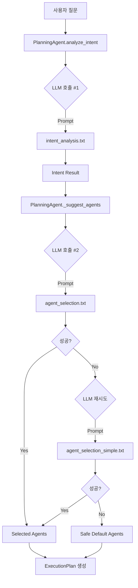
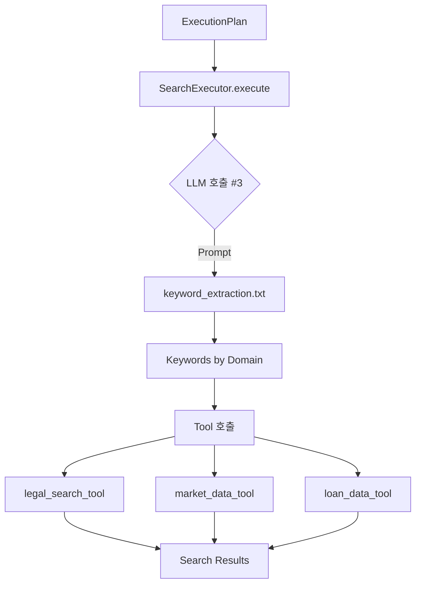
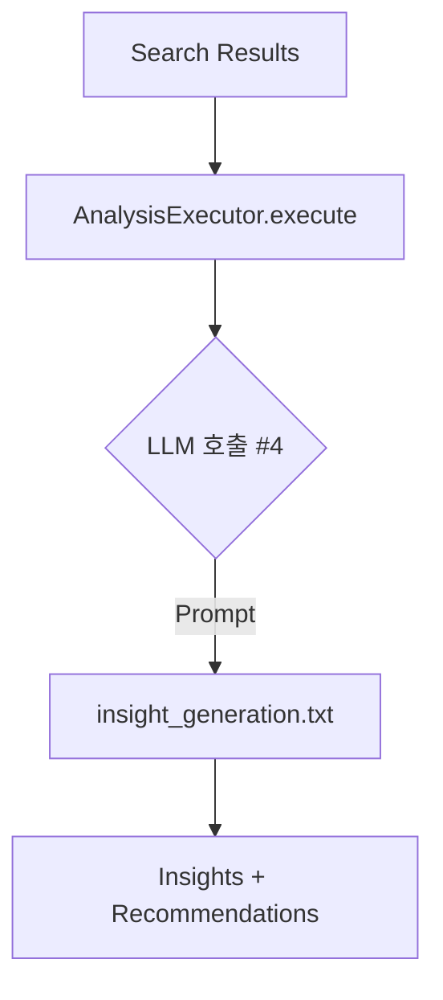
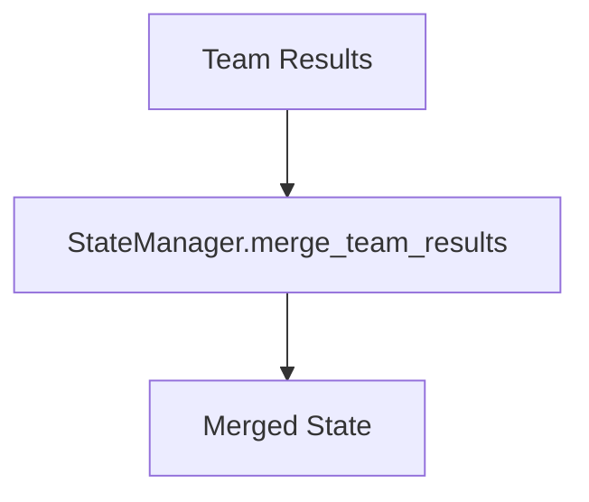
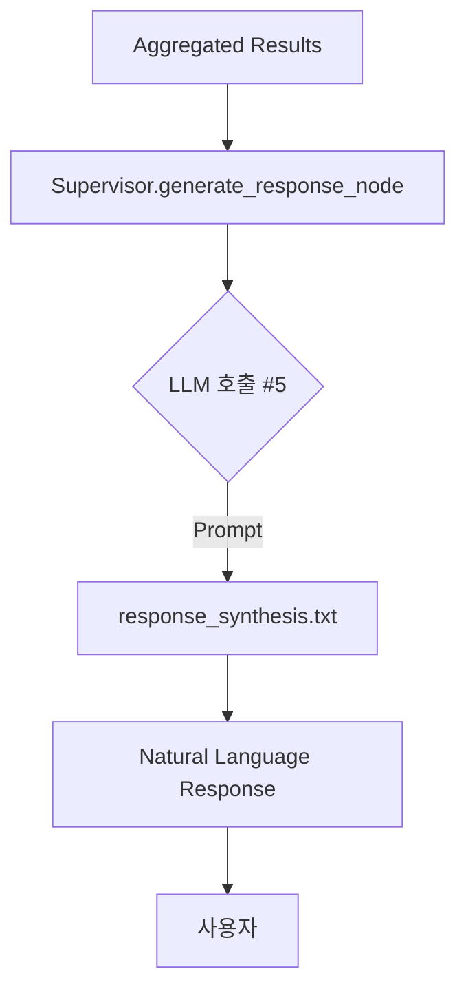

# LLM Manager 기반 전체 시스템 Flow Chart & 프롬프트 사용 메뉴얼

**작성일**: 2025-10-05
**버전**: 1.0
**대상**: 개발자 및 시스템 이해를 위한 상세 가이드

---

## 📋 목차

1. [개요](#1-개요)
2. [전체 시스템 Flow Chart](#2-전체-시스템-flow-chart)
3. [LLM 호출 지점 맵](#3-llm-호출-지점-맵)
4. [프롬프트 카탈로그](#4-프롬프트-카탈로그)
5. [Phase별 프롬프트 사용](#5-phase별-프롬프트-사용)
6. [LLM Manager 아키텍처](#6-llm-manager-아키텍처)
7. [프롬프트 작성 가이드](#7-프롬프트-작성-가이드)
8. [트러블슈팅](#8-트러블슈팅)

---

## 1. 개요

### 1.1 LLM Manager의 역할

```
┌─────────────────────────────────────────────────────────┐
│                    LLM Manager                           │
│  ┌────────────────────────────────────────────────────┐ │
│  │  LLMService                                        │ │
│  │  - LLM API 호출 (OpenAI)                          │ │
│  │  - JSON/Text 응답 처리                            │ │
│  │  - 에러 핸들링 & 재시도                           │ │
│  └────────────────────────────────────────────────────┘ │
│                          ↕                               │
│  ┌────────────────────────────────────────────────────┐ │
│  │  PromptManager                                     │ │
│  │  - 프롬프트 파일 로드 (.txt, .yaml)               │ │
│  │  - 변수 치환 ({query}, {keywords} 등)             │ │
│  │  - 프롬프트 캐싱                                  │ │
│  └────────────────────────────────────────────────────┘ │
│                          ↕                               │
│  ┌────────────────────────────────────────────────────┐ │
│  │  Prompts Directory                                 │ │
│  │  ├── cognitive/    (사고/계획 프롬프트)           │ │
│  │  ├── execution/    (실행 프롬프트)                │ │
│  │  └── common/       (공통 프롬프트)                │ │
│  └────────────────────────────────────────────────────┘ │
└─────────────────────────────────────────────────────────┘
```

### 1.2 핵심 개념

- **중앙 집중 관리**: 모든 프롬프트를 `llm_manager/prompts`에서 관리
- **분리된 관심사**: 프롬프트(템플릿)와 로직(코드)를 분리
- **재사용성**: 동일 프롬프트를 여러 Agent에서 사용 가능
- **버전 관리**: Git으로 프롬프트 변경 이력 추적

---

## 2. 전체 시스템 Flow Chart

### 2.1 High-Level Flow (사용자 → 응답)

```
┌─────────────────────────────────────────────────────────────────┐
│                         사용자 질문                              │
│                  "강남구 아파트 전세 시세와 법적 제한"             │
└─────────────────────────────────────────────────────────────────┘
                              ↓
┌─────────────────────────────────────────────────────────────────┐
│  PHASE 0: 초기화                                                 │
│  ───────────────────────────────────────────────────────────    │
│  TeamBasedSupervisor.initialize_node()                          │
│  - State 준비                                                    │
│  - Session ID 생성                                               │
│  - LLM Context 설정                                              │
└─────────────────────────────────────────────────────────────────┘
                              ↓
┌─────────────────────────────────────────────────────────────────┐
│  PHASE 1: 계획 수립 (Planning)                                   │
│  ───────────────────────────────────────────────────────────    │
│  TeamBasedSupervisor.planning_node()                            │
│       ↓                                                          │
│  ┌─────────────────────────────────────────────────────────┐   │
│  │ PlanningAgent.analyze_intent()                          │   │
│  │                                                          │   │
│  │ 🤖 LLM 호출 #1: 의도 분석                               │   │
│  │ ──────────────────────────────────────────────          │   │
│  │ Prompt: "intent_analysis"                               │   │
│  │ Input:  {query: "강남구 아파트..."}                     │   │
│  │ Model:  GPT-4o-mini (temp=0.1)                          │   │
│  │ Output: {                                               │   │
│  │   intent: "COMPREHENSIVE",                              │   │
│  │   confidence: 0.92,                                     │   │
│  │   keywords: ["강남구", "아파트", "전세", "시세", "법적"] │   │
│  │   entities: {location: "강남구", ...}                   │   │
│  │ }                                                        │   │
│  └─────────────────────────────────────────────────────────┘   │
│       ↓                                                          │
│  ┌─────────────────────────────────────────────────────────┐   │
│  │ PlanningAgent._suggest_agents()                         │   │
│  │                                                          │   │
│  │ 🤖 LLM 호출 #2: Agent 선택                              │   │
│  │ ──────────────────────────────────────────────          │   │
│  │ Prompt: "agent_selection"                               │   │
│  │ Input:  {                                               │   │
│  │   query: "강남구...",                                   │   │
│  │   intent_type: "COMPREHENSIVE",                         │   │
│  │   keywords: [...],                                      │   │
│  │   available_agents: {...}                               │   │
│  │ }                                                        │   │
│  │ Model:  GPT-4o-mini (temp=0.1)                          │   │
│  │ Output: {                                               │   │
│  │   selected_agents: ["search_team", "analysis_team"],    │   │
│  │   reasoning: "법률 검색과 시세 데이터가 필요하며..."    │   │
│  │ }                                                        │   │
│  │                                                          │   │
│  │ ⚠️ 실패 시 Fallback:                                    │   │
│  │ → agent_selection_simple (간소화 프롬프트)              │   │
│  │ → Safe Default (포괄적 조합)                            │   │
│  └─────────────────────────────────────────────────────────┘   │
│       ↓                                                          │
│  ┌─────────────────────────────────────────────────────────┐   │
│  │ PlanningAgent.create_execution_plan()                   │   │
│  │                                                          │   │
│  │ ✅ 계획 생성 (LLM 없음, 로직 기반)                      │   │
│  │ ──────────────────────────────────────────────          │   │
│  │ - ExecutionStep 생성                                    │   │
│  │ - 의존성 설정 (analysis → search)                       │   │
│  │ - 실행 전략 결정 (SEQUENTIAL/PARALLEL)                  │   │
│  │ - 우선순위 설정                                          │   │
│  └─────────────────────────────────────────────────────────┘   │
└─────────────────────────────────────────────────────────────────┘
                              ↓
┌─────────────────────────────────────────────────────────────────┐
│  PHASE 2: 팀 실행 (Execution)                                    │
│  ───────────────────────────────────────────────────────────    │
│  TeamBasedSupervisor.execute_teams_node()                       │
│       ↓                                                          │
│  ┌────────────────────────┬───────────────────────────────┐    │
│  │ SearchExecutor         │ AnalysisExecutor              │    │
│  │                        │                                │    │
│  │ Step 1: 키워드 추출    │ (search 결과 대기)            │    │
│  │ 🤖 LLM 호출 #3         │                                │    │
│  │ ─────────────────      │                                │    │
│  │ Prompt:                │                                │    │
│  │ "keyword_extraction"   │                                │    │
│  │ Input: {               │                                │    │
│  │   query: "강남구...",  │                                │    │
│  │ }                      │                                │    │
│  │ Output: {              │                                │    │
│  │   legal: ["전세", ...],│                                │    │
│  │   real_estate: [...],  │                                │    │
│  │   loan: [...]          │                                │    │
│  │ }                      │                                │    │
│  │     ↓                  │                                │    │
│  │ Step 2: Tool 실행      │                                │    │
│  │ ✅ Tool 호출 (LLM X)   │                                │    │
│  │ ─────────────────      │                                │    │
│  │ - legal_search_tool    │                                │    │
│  │ - market_data_tool     │                                │    │
│  │ - loan_data_tool       │                                │    │
│  │     ↓                  │                                │    │
│  │ Results: [             │                                │    │
│  │   법률 조항 10개,      │                                │    │
│  │   시세 데이터 5개      │ ← 이 결과를 analysis에 전달    │    │
│  │ ]                      │                                │    │
│  └────────────────────────┴───────────────────────────────┘    │
│                                  ↓                               │
│  ┌─────────────────────────────────────────────────────────┐   │
│  │ AnalysisExecutor                                        │   │
│  │                                                          │   │
│  │ 🤖 LLM 호출 #4: 인사이트 생성                           │   │
│  │ ──────────────────────────────────────────────          │   │
│  │ Prompt: "insight_generation"                            │   │
│  │ Input:  {                                               │   │
│  │   query: "강남구...",                                   │   │
│  │   search_results: {                                     │   │
│  │     legal: [...],                                       │   │
│  │     market: [...]                                       │   │
│  │   },                                                     │   │
│  │   analysis_type: "comprehensive"                        │   │
│  │ }                                                        │   │
│  │ Model:  GPT-4o (temp=0.3)                               │   │
│  │ Output: {                                               │   │
│  │   insights: [                                           │   │
│  │     "전세금 5% 인상 제한 적용됨",                       │   │
│  │     "강남구 평균 전세가 상승 추세",                     │   │
│  │     "법적 리스크: 낮음"                                 │   │
│  │   ],                                                     │   │
│  │   recommendations: [...]                                │   │
│  │ }                                                        │   │
│  └─────────────────────────────────────────────────────────┘   │
└─────────────────────────────────────────────────────────────────┘
                              ↓
┌─────────────────────────────────────────────────────────────────┐
│  PHASE 3: 결과 통합 (Aggregation)                                │
│  ───────────────────────────────────────────────────────────    │
│  TeamBasedSupervisor.aggregate_results_node()                   │
│                                                                  │
│  ✅ 데이터 병합 (LLM 없음)                                       │
│  ──────────────────────────────────────────────                 │
│  - SearchTeam 결과 + AnalysisTeam 결과 병합                      │
│  - StateManager로 MainSupervisorState 업데이트                   │
│  - 메타데이터 통합 (sources, timing, status)                    │
└─────────────────────────────────────────────────────────────────┘
                              ↓
┌─────────────────────────────────────────────────────────────────┐
│  PHASE 4: 최종 응답 생성 (Response Generation)                   │
│  ───────────────────────────────────────────────────────────    │
│  TeamBasedSupervisor.generate_response_node()                   │
│                                                                  │
│  🤖 LLM 호출 #5: 응답 합성                                       │
│  ──────────────────────────────────────────────                 │
│  Prompt: "response_synthesis"                                   │
│  Input:  {                                                       │
│    query: "강남구 아파트...",                                    │
│    search_results: {...},                                        │
│    analysis_results: {...},                                      │
│    intent: "COMPREHENSIVE"                                       │
│  }                                                               │
│  Model:  GPT-4o-mini (temp=0.3)                                 │
│  Output: "강남구 아파트 전세의 경우, 법적으로 5% 인상 제한이...  │
│           현재 평균 시세는... 주의하실 점은..."                  │
└─────────────────────────────────────────────────────────────────┘
                              ↓
                       최종 사용자 응답
```

---

## 3. LLM 호출 지점 맵

### 3.1 LLM 호출 요약

| # | Phase | 호출 위치 | 프롬프트 | 목적 | 응답 형식 | Model |
|---|-------|----------|---------|------|----------|-------|
| 1 | Planning | PlanningAgent.analyze_intent() | `intent_analysis` | 사용자 의도 분석 | JSON | GPT-4o-mini |
| 2 | Planning | PlanningAgent._suggest_agents() | `agent_selection` | Agent 선택 | JSON | GPT-4o-mini |
| 2b| Planning | (Fallback) | `agent_selection_simple` | Agent 선택 (간소화) | JSON | GPT-4o-mini |
| 3 | Execution | SearchExecutor.extract_keywords() | `keyword_extraction` | 검색 키워드 추출 | JSON | GPT-4o-mini |
| 4 | Execution | AnalysisExecutor.generate_insights() | `insight_generation` | 데이터 분석 및 인사이트 | JSON | GPT-4o |
| 5 | Response | Supervisor.generate_response_node() | `response_synthesis` | 최종 자연어 응답 생성 | Text | GPT-4o-mini |
| * | Error | (Any) | `error_response` | 에러 상황 응답 | Text | GPT-4o-mini |

### 3.2 파일별 LLM 호출 위치

#### cognitive_agents/planning_agent.py
```python
# 1. 의도 분석
async def _analyze_with_llm(self, query: str):
    result = await self.llm_service.complete_json_async(
        prompt_name="intent_analysis",  # ← Prompt #1
        variables={"query": query},
        temperature=0.1
    )

# 2. Agent 선택 (Primary)
async def _select_agents_with_llm(self, intent_type, query, keywords):
    result = await self.llm_service.complete_json_async(
        prompt_name="agent_selection",  # ← Prompt #2
        variables={
            "query": query,
            "intent_type": intent_type.value,
            "keywords": keywords,
            "available_agents": {...}
        },
        temperature=0.1
    )

# 3. Agent 선택 (Fallback)
async def _select_agents_with_llm_simple(self, intent_type, query):
    result = await self.llm_service.complete_json_async(
        prompt_name="agent_selection_simple",  # ← Prompt #2b
        variables={"query": query, "intent_type": intent_type.value},
        temperature=0.3
    )
```

#### execution_agents/search_executor.py
```python
# 4. 키워드 추출
def extract_keywords(self, query: str):
    result = self.llm_service.complete_json(
        prompt_name="keyword_extraction",  # ← Prompt #3
        variables={"query": query},
        temperature=0.1
    )
```

#### execution_agents/analysis_executor.py
```python
# 5. 인사이트 생성
async def generate_insights(self, query, search_results):
    result = await self.llm_service.complete_json_async(
        prompt_name="insight_generation",  # ← Prompt #4
        variables={
            "query": query,
            "search_results": search_results,
            "analysis_type": "comprehensive"
        },
        temperature=0.3
    )
```

#### supervisor/team_supervisor.py
```python
# 6. 최종 응답 합성
async def generate_response_node(self, state):
    answer = await self.planning_agent.llm_service.complete_async(
        prompt_name="response_synthesis",  # ← Prompt #5
        variables={
            "query": query,
            "search_results": {...},
            "analysis_results": {...}
        },
        temperature=0.3
    )
```

---

## 4. 프롬프트 카탈로그

### 4.1 프롬프트 디렉토리 구조

```
llm_manager/prompts/
│
├── cognitive/                      # 사고/계획 단계 프롬프트
│   ├── intent_analysis.txt         # 의도 분석
│   ├── agent_selection.txt         # Agent 선택 (상세)
│   ├── agent_selection_simple.txt  # Agent 선택 (간소화)
│   └── plan_generation.txt         # 실행 계획 생성 (미사용)
│
├── execution/                      # 실행 단계 프롬프트
│   ├── keyword_extraction.txt      # 키워드 추출
│   ├── insight_generation.txt      # 인사이트 생성
│   └── response_synthesis.txt      # 응답 합성
│
└── common/                         # 공통 프롬프트
    └── error_response.txt          # 에러 응답
```

### 4.2 각 프롬프트 상세

#### 📄 intent_analysis.txt

**위치**: `prompts/cognitive/intent_analysis.txt`
**사용 위치**: `PlanningAgent._analyze_with_llm()`
**호출 빈도**: 사용자 요청당 1회 (Phase 1)

**입력 변수**:
```python
{
    "query": str  # 사용자 질문
}
```

**출력 형식**:
```json
{
    "intent": "LEGAL_CONSULT | MARKET_INQUIRY | LOAN_CONSULT | CONTRACT_CREATION | CONTRACT_REVIEW | COMPREHENSIVE | RISK_ANALYSIS | UNCLEAR | IRRELEVANT",
    "confidence": 0.0~1.0,
    "keywords": ["키워드1", "키워드2", ...],
    "entities": {
        "location": "강남구",
        "price": "5억",
        "contract_type": "전세",
        ...
    },
    "reasoning": "분류 이유 상세 설명"
}
```

**역할**: 사용자 질문을 9가지 의도 중 하나로 분류하고, 주요 키워드와 엔티티를 추출

---

#### 📄 agent_selection.txt

**위치**: `prompts/cognitive/agent_selection.txt`
**사용 위치**: `PlanningAgent._select_agents_with_llm()`
**호출 빈도**: 의도 분석 후 1회 (Phase 1)

**입력 변수**:
```python
{
    "query": str,           # 사용자 질문
    "intent_type": str,     # 분석된 의도
    "keywords": list,       # 추출된 키워드
    "available_agents": {   # Agent 정보
        "search_team": {
            "capabilities": "법률 검색, 부동산 시세 조회...",
            "tools": ["legal_search", "market_data", ...],
            "use_cases": [...]
        },
        ...
    }
}
```

**출력 형식**:
```json
{
    "selected_agents": ["search_team", "analysis_team"],
    "reasoning": "선택 이유: 법률 검색과 시세 데이터가 필요하며, 분석을 통해 인사이트 제공..."
}
```

**역할**: 사용 가능한 Agent 정보를 기반으로 질문에 가장 적합한 Agent 조합 선택

---

#### 📄 agent_selection_simple.txt

**위치**: `prompts/cognitive/agent_selection_simple.txt`
**사용 위치**: `PlanningAgent._select_agents_with_llm_simple()` (Fallback)
**호출 빈도**: Primary 실패 시 1회

**입력 변수**:
```python
{
    "query": str,
    "intent_type": str
}
```

**출력 형식**:
```json
{
    "agents": ["search_team"]
}
```

**역할**: 간소화된 프롬프트로 빠른 Agent 선택 (복잡한 상황 판단 불가)

---

#### 📄 keyword_extraction.txt

**위치**: `prompts/execution/keyword_extraction.txt`
**사용 위치**: `SearchExecutor.extract_keywords()`
**호출 빈도**: 검색 실행 시 1회 (Phase 2)

**입력 변수**:
```python
{
    "query": str  # 사용자 질문
}
```

**출력 형식**:
```json
{
    "legal": ["전세", "임대차", "보증금"],
    "real_estate": ["강남구", "아파트", "시세"],
    "loan": []
}
```

**역할**: 검색 도메인별 키워드를 추출하여 Tool 호출에 활용

---

#### 📄 insight_generation.txt

**위치**: `prompts/execution/insight_generation.txt`
**사용 위치**: `AnalysisExecutor.generate_insights()`
**호출 빈도**: 분석 실행 시 1회 (Phase 2)

**입력 변수**:
```python
{
    "query": str,
    "search_results": {
        "legal": [...],
        "market": [...],
        "loan": [...]
    },
    "analysis_type": "comprehensive"
}
```

**출력 형식**:
```json
{
    "insights": [
        {
            "type": "legal_compliance",
            "content": "전세금 5% 인상 제한 적용됨",
            "confidence": 0.95
        },
        {
            "type": "market_trend",
            "content": "강남구 전세가 상승 추세",
            "confidence": 0.85
        }
    ],
    "recommendations": [
        "계약 갱신 시 5% 인상 제한 확인 필요",
        "시세 상승 고려하여 조기 계약 검토"
    ],
    "risk_level": "low"
}
```

**역할**: 검색 결과를 분석하여 인사이트와 추천사항 생성

---

#### 📄 response_synthesis.txt

**위치**: `prompts/execution/response_synthesis.txt`
**사용 위치**: `TeamBasedSupervisor.generate_response_node()`
**호출 빈도**: 최종 응답 생성 시 1회 (Phase 4)

**입력 변수**:
```python
{
    "query": str,
    "search_results": {...},
    "analysis_results": {...},
    "intent": str
}
```

**출력 형식**: Text (자연어 응답)

**예시 출력**:
```
강남구 아파트 전세에 대해 안내드리겠습니다.

【법적 제한】
전세금 인상은 5% 이내로 제한됩니다 (주택임대차보호법 제7조).

【시세 정보】
현재 강남구 아파트 전세 평균 시세는 약 8억원이며, 전년 대비 3% 상승했습니다.

【주의사항】
- 계약 갱신 시 5% 인상 제한 확인 필요
- 시세 상승 추세이므로 조기 계약 검토 권장

추가 궁금하신 사항이 있으시면 말씀해 주세요.
```

**역할**: 모든 결과를 종합하여 사용자가 이해하기 쉬운 자연어 응답 생성

---

#### 📄 error_response.txt

**위치**: `prompts/common/error_response.txt`
**사용 위치**: 에러 발생 시 전역적으로 사용
**호출 빈도**: 에러 발생 시

**입력 변수**:
```python
{
    "error_type": str,
    "error_message": str,
    "user_query": str
}
```

**출력 형식**: Text

**역할**: 에러 상황을 사용자에게 친절하게 설명

---

## 5. Phase별 프롬프트 사용

### Phase 1: Planning (계획 수립)



**사용 프롬프트**:
1. ✅ `intent_analysis.txt` (필수)
2. ✅ `agent_selection.txt` (Primary)
3. ⚠️ `agent_selection_simple.txt` (Fallback)

**특징**:
- LLM 기반 의사결정 (동적, 유연)
- 2단계 Fallback 전략 (품질 유지)
- 계획 생성은 로직 기반 (LLM 불필요)

---

### Phase 2: Execution (실행)

#### 2-1. SearchExecutor



**사용 프롬프트**:
1. ✅ `keyword_extraction.txt` (검색 최적화)

**특징**:
- Tool 호출 전 LLM으로 키워드 정제
- Tool 자체는 LLM 없이 작동 (DB 검색)

#### 2-2. AnalysisExecutor



**사용 프롬프트**:
1. ✅ `insight_generation.txt` (핵심 분석)

**특징**:
- SearchExecutor 결과를 입력으로 사용
- GPT-4o 사용 (고품질 분석 필요)
- 의존성: search → analysis

---

### Phase 3: Aggregation (통합)



**사용 프롬프트**:
- ❌ LLM 사용 안 함 (데이터 병합만)

**특징**:
- 순수 로직 기반
- State Pollution 방지

---

### Phase 4: Response Generation (응답 생성)



**사용 프롬프트**:
1. ✅ `response_synthesis.txt` (최종 출력)

**특징**:
- 모든 결과를 종합하여 자연어로 변환
- 사용자 친화적 형식으로 재구성
- 추가 질문 유도

---

## 6. LLM Manager 아키텍처

### 6.1 LLMService 사용법

```python
from app.service_agent.llm_manager import LLMService

# 초기화
llm_service = LLMService(llm_context=llm_context)

# JSON 응답 (동기)
result = llm_service.complete_json(
    prompt_name="intent_analysis",
    variables={"query": "전세 계약은?"},
    temperature=0.1,
    max_tokens=500
)

# JSON 응답 (비동기)
result = await llm_service.complete_json_async(
    prompt_name="agent_selection",
    variables={...}
)

# 텍스트 응답 (비동기)
response = await llm_service.complete_async(
    prompt_name="response_synthesis",
    variables={...}
)
```

### 6.2 PromptManager 사용법

```python
from app.service_agent.llm_manager import PromptManager

# 초기화
pm = PromptManager()

# 프롬프트 로드
prompt = pm.get(
    prompt_name="intent_analysis",
    variables={"query": "강남구 전세"},
    category="cognitive"  # Optional
)

# 사용 가능한 프롬프트 목록
prompts = pm.list_prompts()
# {
#   "cognitive": ["intent_analysis", "agent_selection", ...],
#   "execution": ["keyword_extraction", ...],
#   "common": ["error_response"]
# }

# 프롬프트 유효성 검증
is_valid = pm.validate(
    prompt_name="intent_analysis",
    required_variables=["query"]
)

# 캐시 초기화 (프롬프트 재로드)
pm.reload()
```

### 6.3 프롬프트 파일 형식

#### TXT 형식 (권장)
```
당신은 부동산 AI 시스템의 의도 분석 전문가입니다.

사용자 질문: {query}

다음 JSON 형식으로 응답하세요:
{{
    "intent": "...",
    "confidence": 0.0~1.0,
    "keywords": [...]
}}
```

#### YAML 형식 (메타데이터 포함)
```yaml
metadata:
  version: "1.0"
  author: "홈즈냥즈"
  created: "2025-01-02"
  model: "gpt-4o-mini"
  temperature: 0.1

system_prompt: |
  당신은 부동산 AI 시스템의 의도 분석 전문가입니다.

  사용자 질문: {query}

  다음 JSON 형식으로 응답하세요:
  {
      "intent": "...",
      "confidence": 0.0~1.0
  }
```

---

## 7. 프롬프트 작성 가이드

### 7.1 프롬프트 작성 원칙

1. **명확한 역할 정의**
   ```
   ✅ 좋은 예: "당신은 부동산 AI 시스템의 의도 분석 전문가입니다."
   ❌ 나쁜 예: "의도를 분석하세요."
   ```

2. **구체적인 예시 제공**
   ```
   ✅ 좋은 예:
   - 예시: "강남구 전세 시세" → MARKET_INQUIRY
   - 예시: "전세금 인상 제한은?" → LEGAL_CONSULT

   ❌ 나쁜 예: "적절히 분류하세요."
   ```

3. **명확한 출력 형식**
   ```
   ✅ 좋은 예:
   JSON 형식으로 응답:
   {
       "intent": "카테고리명",
       "confidence": 0.0~1.0,
       "keywords": ["키워드1", "키워드2"]
   }

   ❌ 나쁜 예: "JSON으로 답하세요."
   ```

4. **변수 사용**
   ```python
   # {variable_name} 형식으로 변수 정의
   "사용자 질문: {query}"
   "분석 타입: {analysis_type}"
   ```

### 7.2 프롬프트 테스트

```python
# llm_manager/test_llm_manager.py
import pytest
from app.service_agent.llm_manager import LLMService

def test_intent_analysis_prompt():
    llm_service = LLMService()

    result = llm_service.complete_json(
        prompt_name="intent_analysis",
        variables={"query": "강남구 전세 시세"}
    )

    assert "intent" in result
    assert "confidence" in result
    assert result["intent"] in ["MARKET_INQUIRY", "COMPREHENSIVE"]
    assert 0.0 <= result["confidence"] <= 1.0
```

### 7.3 프롬프트 버전 관리

```bash
# Git으로 프롬프트 변경 추적
git log prompts/cognitive/intent_analysis.txt

# 프롬프트 A/B 테스트
# 1. 새 버전 작성
prompts/cognitive/intent_analysis_v2.txt

# 2. 코드에서 전환
prompt_name = "intent_analysis_v2"  # 실험 버전

# 3. 성능 비교 후 결정
```

---

## 8. 트러블슈팅

### 8.1 프롬프트 로드 실패

**증상**:
```
FileNotFoundError: Prompt file not found: intent_analysis
```

**해결**:
1. 파일 존재 확인
   ```bash
   ls llm_manager/prompts/cognitive/intent_analysis.txt
   ```

2. 파일 이름 확인 (확장자 포함)
   ```python
   # ❌ 잘못된 예
   prompt_name="intent_analysis.txt"

   # ✅ 올바른 예
   prompt_name="intent_analysis"  # 확장자 제외
   ```

3. 카테고리 확인
   ```python
   # 자동 탐색 (권장)
   pm.get(prompt_name="intent_analysis")

   # 수동 지정
   pm.get(prompt_name="intent_analysis", category="cognitive")
   ```

### 8.2 변수 치환 실패

**증상**:
```
KeyError: 'query'
Missing required variable query for prompt 'intent_analysis'
```

**해결**:
1. 필수 변수 확인
   ```python
   # 프롬프트에 {query}가 있으면 반드시 전달
   llm_service.complete_json(
       prompt_name="intent_analysis",
       variables={"query": "전세 계약"}  # ← 필수
   )
   ```

2. 변수명 대소문자 일치
   ```python
   # 프롬프트: {query}
   # ✅ 올바름
   variables={"query": "..."}

   # ❌ 틀림
   variables={"Query": "..."}  # 대소문자 불일치
   ```

### 8.3 LLM 응답 형식 오류

**증상**:
```
JSONDecodeError: Expecting value: line 1 column 1 (char 0)
```

**해결**:
1. 프롬프트에서 JSON 형식 강조
   ```
   ✅ 개선:
   "반드시 다음 JSON 형식으로만 응답하세요. 설명은 포함하지 마세요:"
   {
       "intent": "...",
       ...
   }
   ```

2. response_format 지정
   ```python
   llm_service.complete_json_async(
       prompt_name="intent_analysis",
       variables={...},
       response_format={"type": "json_object"}  # ← 강제
   )
   ```

3. 온도 낮추기
   ```python
   temperature=0.1  # 더 일관된 형식
   ```

### 8.4 LLM Agent 선택 실패

**증상**:
모든 LLM 시도가 실패하고 Safe Default 사용

**해결**:
1. API 키 확인
   ```python
   echo $OPENAI_API_KEY
   ```

2. 네트워크 연결 확인
   ```python
   curl https://api.openai.com/v1/models
   ```

3. 로그 확인
   ```python
   logger.warning("⚠️ Primary LLM agent selection failed: {e}")
   logger.warning("⚠️ Simplified LLM agent selection failed: {e}")
   ```

4. Fallback 동작 확인
   ```python
   # Safe Default가 적절한지 검증
   safe_defaults = {
       IntentType.UNCLEAR: ["search_team", "analysis_team"]  # 포괄적
   }
   ```

---

## 9. 부록

### 9.1 프롬프트 목록 (빠른 참조)

| 프롬프트 | 카테고리 | 입력 | 출력 | 용도 |
|---------|---------|------|------|------|
| intent_analysis | cognitive | query | JSON | 의도 분석 |
| agent_selection | cognitive | query, intent_type, keywords, available_agents | JSON | Agent 선택 |
| agent_selection_simple | cognitive | query, intent_type | JSON | Agent 선택 (간소화) |
| keyword_extraction | execution | query | JSON | 키워드 추출 |
| insight_generation | execution | query, search_results, analysis_type | JSON | 인사이트 생성 |
| response_synthesis | execution | query, search_results, analysis_results | Text | 최종 응답 |
| error_response | common | error_type, error_message, user_query | Text | 에러 응답 |

### 9.2 Model 사용 현황

| Phase | Prompt | Model | Temperature | Max Tokens |
|-------|--------|-------|-------------|------------|
| Planning | intent_analysis | GPT-4o-mini | 0.1 | 500 |
| Planning | agent_selection | GPT-4o-mini | 0.1 | 500 |
| Planning | agent_selection_simple | GPT-4o-mini | 0.3 | 300 |
| Execution | keyword_extraction | GPT-4o-mini | 0.1 | 300 |
| Execution | insight_generation | GPT-4o | 0.3 | 1000 |
| Response | response_synthesis | GPT-4o-mini | 0.3 | 1500 |

### 9.3 비용 최적화 팁

1. **캐싱 활용**
   - PromptManager가 프롬프트 자동 캐싱
   - 동일 프롬프트 반복 로드 시 파일 I/O 없음

2. **온도 설정**
   - 분류/추출: temperature=0.1 (일관성)
   - 생성/합성: temperature=0.3 (창의성)

3. **Model 선택**
   - 단순 작업: GPT-4o-mini (저렴)
   - 복잡 분석: GPT-4o (고품질)

4. **토큰 제한**
   - max_tokens 적절히 설정
   - 불필요한 장문 생성 방지

---

## 변경 이력

| 날짜 | 버전 | 변경 내용 |
|------|------|----------|
| 2025-10-05 | 1.0 | 초기 작성 |

---

**문의**: 시스템 개선 제안이나 질문은 이슈로 등록해 주세요.
